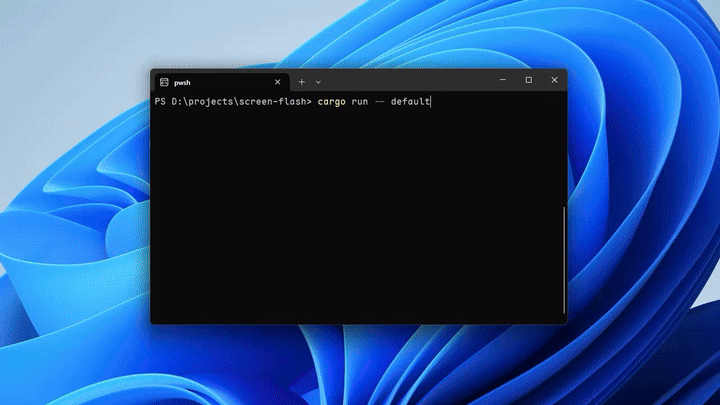

# screen-flash

[English README](./README.md)

一个面向 Windows 的 Rust 库，用于在全屏范围内显示一次闪烁覆盖层。

项目同时提供两层能力：

- 库：调用方实现或构造一个 `FlashEffect`
- CLI：直接选择内置效果并运行一次闪烁

核心模型是“效果采样”：

- 不直接传颜色和时长参数
- 每一帧的颜色、不透明度和下一次采样时间都由 `FlashEffect::sample` 决定

## 特性

- Windows 全屏覆盖层闪烁
- RGB 颜色控制
- 动画采样使用归一化 alpha：`0.0..=1.0`
- 支持可变步长
- 支持颜色随时间变化

## 平台

- 仅支持 Windows
- 依赖 Win32 API：`CreateWindowExW`、`SetLayeredWindowAttributes`、`RegisterClassW` 等
- 当前还没有其他平台的实现，欢迎贡献 macOS、Linux 等平台的支持

## 作为库使用

```toml
[dependencies]
screen-flash = { path = "." }
```

如果你要发布到 crates.io，再把 `path` 替换成版本号。

## 快速开始

使用内置默认效果：

```rust
use screen_flash::{DefaultFlashEffect, FlashColor, flash_screen};

fn main() -> windows::core::Result<()> {
    flash_screen(DefaultFlashEffect {
        color: FlashColor {
            red: 255,
            green: 255,
            blue: 255,
        },
    })
}
```

## 演示

这个动图目前包含了三种效果演示：

- 黑色的默认闪烁
- 白色的默认闪烁
- 彩虹闪烁



## 核心接口

库入口：

```rust
pub fn flash_screen<E>(effect: E) -> Result<()>
where
    E: FlashEffect
```

颜色类型：

```rust
pub struct FlashColor {
    pub red: u8,
    pub green: u8,
    pub blue: u8,
}
```

效果采样结果：

```rust
pub struct FlashSample {
    pub color: FlashColor,
    pub alpha: f32,
    pub next_step_ms: Option<u64>,
}
```

语义说明：

- `color`：该帧应使用的颜色
- `alpha`：该帧应使用的不透明度，范围 `0.0..=1.0`
- `next_step_ms`：下一次采样延迟
- `Some(ms)`：`ms` 毫秒后继续
- `None`：效果结束

效果 trait：

```rust
pub trait FlashEffect {
    fn sample(&self, elapsed_ms: u64) -> FlashSample;
}
```

## 自定义效果

下面这个例子会在 500ms 内从红色逐渐淡出到透明：

```rust
use screen_flash::{FlashColor, FlashEffect, FlashSample, flash_screen};

struct RedFade;

impl FlashEffect for RedFade {
    fn sample(&self, elapsed_ms: u64) -> FlashSample {
        let duration_ms = 500;
        let finished = elapsed_ms >= duration_ms;
        let remaining = duration_ms.saturating_sub(elapsed_ms) as f32 / duration_ms as f32;

        FlashSample {
            color: FlashColor {
                red: 255,
                green: 0,
                blue: 0,
            },
            alpha: remaining.clamp(0.0, 1.0),
            next_step_ms: if finished { None } else { Some(16) },
        }
    }
}

fn main() -> windows::core::Result<()> {
    flash_screen(RedFade)
}
```

## 内置效果

库内置了 2 个效果：

- `DefaultFlashEffect`：颜色可自定义，先保持较高亮度，再逐渐淡出
- `RainbowFlashEffect`：持续时间更长，闪烁期间颜色持续变化，并保持固定不透明度直到结束

`DefaultFlashEffect` 的行为如下：

- 开始阶段保持较高亮度
- 后续逐渐淡出
- 默认步长为 `16ms`

默认效果本身不限制颜色，颜色由 `DefaultFlashEffect { color }` 提供。

彩虹效果示例：

```rust
use screen_flash::{RainbowFlashEffect, flash_screen};

fn main() -> windows::core::Result<()> {
    flash_screen(RainbowFlashEffect)
}
```

## CLI

如果你想直接把仓库当命令行工具运行，可以在根目录执行：

```powershell
cargo run -- default
cargo run -- rainbow
```

如果使用 `default`，还可以额外指定颜色：

```powershell
cargo run -- default --color ff6600
cargo run -- default --color 255,102,0
```

## 设计说明

当前抽象把“动画”和“渲染状态”合并成一层效果采样：

- 不是只返回 alpha
- 而是直接返回一帧完整视觉状态

这样可以自然支持：

- 固定颜色闪烁
- 颜色渐变
- 固定不透明度或渐隐
- 可变步长调度

## 测试

运行：

```powershell
cargo test
```
